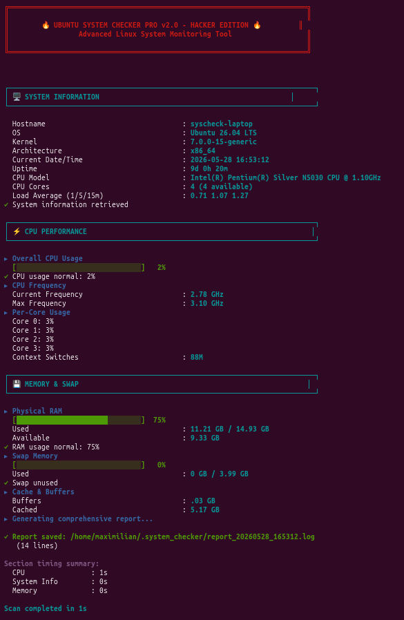

# Syscheck - Ubuntu System Checker


A fast and detailed Ubuntu system diagnostics tool written in pure Bash.

Syscheck analyzes performance, security, updates, hardware, processes, services and generates professional terminal reports directly from the command line.

## Preview


---

## Features

* Fast Ubuntu system diagnostics
* Security and update analysis
* CPU, RAM, disk and network monitoring
* Hardware and process inspection
* JSON export support
* Live monitoring mode
* Configurable settings
* Clean hacker-style terminal UI
* Lightweight single-file Bash architecture
* Report history support

---

## Why Syscheck?

Syscheck was built as a lightweight alternative to heavy monitoring suites.

It focuses on:

* speed
* readability
* terminal-first workflow
* zero telemetry
* single-file portability
* simple installation

---

## Requirements

Required:

* bash
* timeout
* awk
* sed
* grep
* cut
* head
* tail
* wc
* bc
* date
* uname

Optional:

* python3
* lm-sensors
* dmidecode
* lspci
* lsblk
* ss

---

## Quick Install

```bash
git clone https://github.com/StringMAXprogr/syscheck.git
cd syscheck
chmod +x install.sh
./install.sh
```

After installation:

```bash
syscheck --help
```

---

## Uninstallation

```bash
chmod +x uninstall.sh
./uninstall.sh
```

---

Installed command:

```bash
syscheck
```

---

## Examples

Quick scan:

```bash
syscheck --quick
```

JSON export:

```bash
syscheck --json
```

Live mode:

```bash
syscheck --live
```

Full report:

```bash
syscheck --full
```

---

## Command Options

| Option              | Description           |
| ------------------- | --------------------- |
| `--help`            | Show help menu        |
| `--version`         | Show version          |
| `--quick`           | Fast system scan      |
| `--full`            | Full report           |
| `--cpu`             | CPU section only      |
| `--memory`          | Memory section only   |
| `--disk`            | Disk section only     |
| `--network`         | Network section only  |
| `--security`        | Security section only |
| `--json`            | Export JSON report    |
| `--live`            | Live monitoring       |
| `--live-interval N` | Refresh interval      |
| `--verbose`         | Verbose output        |
| `--debug`           | Developer debug mode  |
| `--quiet`           | Quiet mode            |


---

## Compared to Other Tools

| Tool     | Lightweight | JSON | Live Mode | Single File |
| -------- | ----------- | ---- | --------- | ----------- |
| Syscheck | ✅           | ✅    | ✅         | ✅           |
| neofetch | ❌           | ❌    | ❌         | ✅           |
| htop     | ❌           | ❌    | ✅         | ❌           |

---


# LICENSE

MIT License

Copyright (c) 2026 StringMAX

Permission is hereby granted, free of charge, to any person obtaining a copy
of this software and associated documentation files (the "Software"), to deal
in the Software without restriction, including without limitation the rights
to use, copy, modify, merge, publish, distribute, sublicense, and/or sell
copies of the Software, and to permit persons to whom the Software is
furnished to do so, subject to the following conditions:

The above copyright notice and this permission notice shall be included in all
copies or substantial portions of the Software.

THE SOFTWARE IS PROVIDED "AS IS", WITHOUT WARRANTY OF ANY KIND, EXPRESS OR
IMPLIED, INCLUDING BUT NOT LIMITED TO THE WARRANTIES OF MERCHANTABILITY,
FITNESS FOR A PARTICULAR PURPOSE AND NONINFRINGEMENT. IN NO EVENT SHALL THE
AUTHORS OR COPYRIGHT HOLDERS BE LIABLE FOR ANY CLAIM, DAMAGES OR OTHER
LIABILITY, WHETHER IN AN ACTION OF CONTRACT, TORT OR OTHERWISE, ARISING FROM,
OUT OF OR IN CONNECTION WITH THE SOFTWARE OR THE USE OR OTHER DEALINGS IN THE
SOFTWARE.
